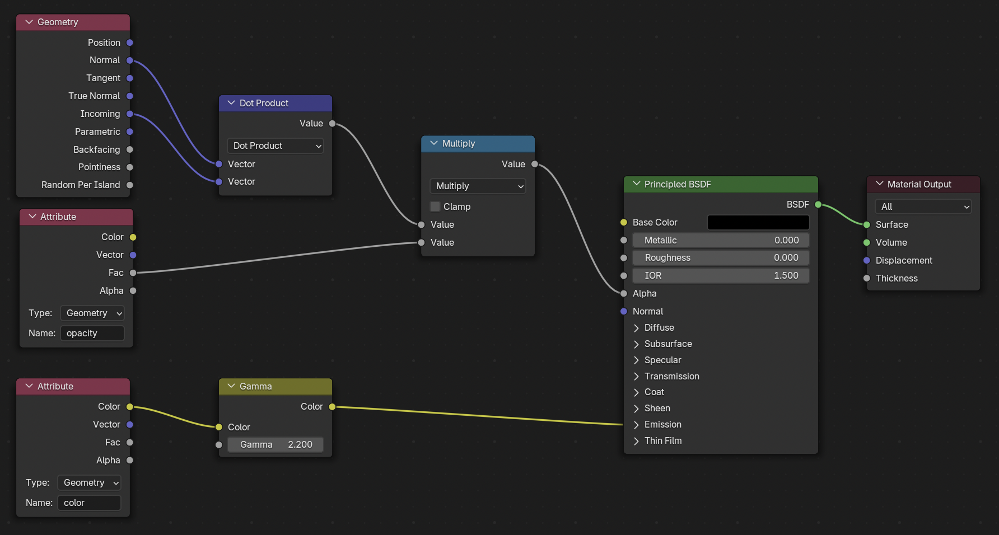
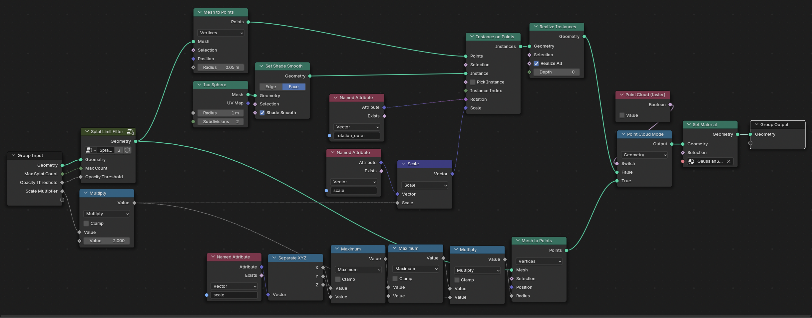

# Gaussian Splat Previewer for Blender

A demo Blender Python addon for viewing Gaussian splats, implemented via **Geometry Nodes** and **Shader Nodes**. This addon enables previewing USDZ exports from the World Labs API directly in Blender.

> ⚠️ **Note**: This addon is intended for **demo purposes / splat preview purposes only** and is not production-grade. It serves as an example of how to take the `worldlabs-api` USDZ export and write an adapter using [OpenUSD (PyUSD)](https://openusd.org/).

## Features

- Import and visualize Gaussian splats from USDZ files
- Two rendering modes:
  - **Ellipsoid mode**: Full 3D Gaussian representation (slower, more accurate)
  - **Point cloud mode**: Fast preview using spherical points
- Real-time adjustment of:
  - Maximum splat count
  - Opacity threshold filtering
  - Scale multiplier
- Automatic gamma correction for proper color display

## How It Works

The addon parses USDZ files exported from the World Labs API using `pxr.Usd` (OpenUSD/PyUSD). Gaussian splat data (positions, scales, rotations, opacities, and colors) is extracted and converted into Blender mesh attributes. The visualization is then handled entirely through Blender's node systems:

### Shader Node Graph

The material uses a custom shader that:
- Computes view-dependent opacity using dot product of normal and incoming vectors
- Applies gamma correction (2.2) to the splat colors
- Uses emission-based rendering for accurate color display



### Geometry Node Graph

The geometry nodes handle:
- Ellipsoid instancing using Ico Spheres with per-splat rotation and scale
- Point cloud fallback for faster viewport performance
Geometry instancing implemented in this simple fashion does not scale well to millions of splats, so we provide preemptive culling via
- Splat filtering by opacity threshold (to cull more transparent splats)
- Scale-based sorting after opacity threshold sorting (to cull smaller splats)



## Requirements

- **Blender 4.0+** (includes bundled OpenUSD support)
- USDZ files exported from the World Labs API

## Installation

1. **Download the addon**
   
   Zip the `examples/blender_addon` folder:
   ```bash
   cd worldlabs-api-python/examples
   zip -r blender_addon.zip blender_addon
   ```

2. **Install in Blender**
   
   - Open Blender
   - Go to **Edit → Preferences → Add-ons**
   - Click **Install...** and select `blender_addon.zip`
   - Enable the addon by checking "USD Gaussian Splats Previewer"

3. **Access the addon**
   
   - Open the 3D Viewport sidebar (press `N`)
   - Find the **Splats Preview** tab

## Usage

1. Click **Import Splat** in the Splats Preview panel
2. Select a `.usdz` file exported from the World Labs API
3. Adjust settings as needed:
   - **Max Splats**: Limit the number of displayed splats for performance
   - **Opacity Threshold**: Filter out low-opacity splats
   - **Scale Multiplier**: Adjust splat size
   - **Point Cloud (faster)**: Toggle between ellipsoid and point cloud rendering

## Configuration Defaults

Default import settings can be configured in **Edit → Preferences → Add-ons → USD Gaussian Splats Previewer**:

| Setting | Default | Description |
|---------|---------|-------------|
| Max Splat Count | 500,000 | Maximum splats to display |
| Opacity Threshold | 0.2 | Minimum opacity to include |
| Scale Multiplier | 1.0 | Splat size multiplier |
| Point Cloud Mode | Off | Use faster point rendering |

## USDZ Format Details

The addon expects USDZ files with the following attributes on the default prim:

| Attribute | Type | Description |
|-----------|------|-------------|
| `positions` | Vec3f[] | Splat center positions |
| `scales` | Vec3f[] | Log-scale values (exp applied on load) |
| `rotations` | Quatf[] | Quaternions (w, x, y, z) |
| `densities` | float[] | Logit-opacity values (sigmoid applied on load) |
| `features_albedo` | Color3f[] | RGB colors |

## Troubleshooting

### "from pxr import Usd" fails
Blender 4.0+ includes OpenUSD support. For older versions, install manually:
```bash
/path/to/blender/python/bin/python -m pip install usd-core
```

### Performance issues with large splats
- Reduce **Max Splat Count**
- Enable **Point Cloud Mode** for faster viewport performance
- Use EEVEE renderer (set automatically on import)

## Credits

Based on [gaussian-splatting-blender-addon](https://github.com/ReshotAI/gaussian-splatting-blender-addon), simplified to use RGB colors without spherical harmonics.

## License

This addon is provided as part of the `worldlabs-api-python` examples and follows the same license terms.

